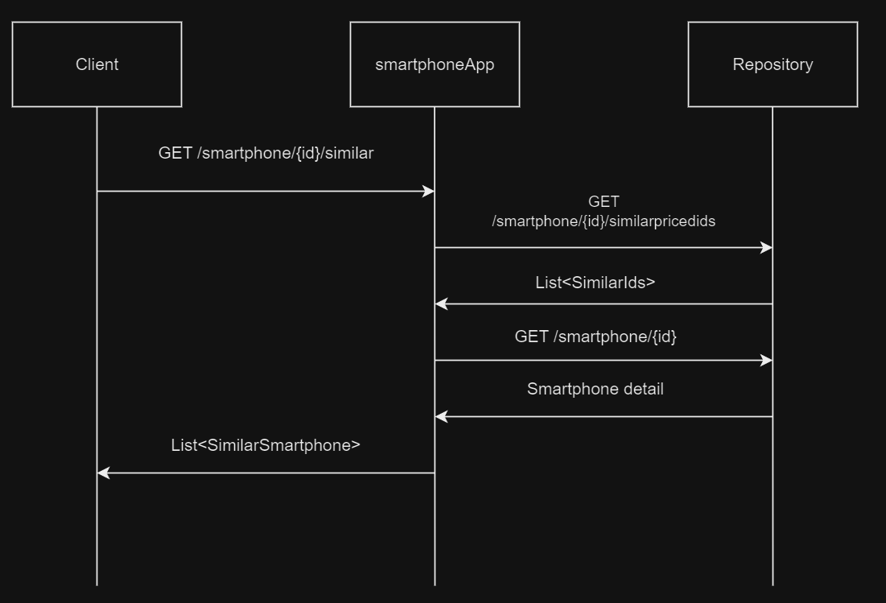

# Backend 
This a backend test to evaluate your level and understanding of the problem to be solved, 
for this we need you to implement the application as completely as possible, please read the instructions carefully.

We are a smartphones selling company, and we want to offer our customers an API that returns similar priced phones 
for a given one. 

To do this will create a REST operation that will return the similar priced phones list with its characteristics 
for a given phone. 

[Here](./similarPricedSmartphones.yaml) is the contract we agreed with the consumers.

We already have an endpoint that provides the ids of the similar priced phones for a given one. 
We also have another endpoint that returns the smartphone detail by Id. 

[Here](./APIs.yaml) you have the documentation of the existing endpoints.

**Create a Spring boot application that exposes the agreed REST API on port 5000.**



YOU MUST ONLY IMPLEMENT 'smartphoneApp'. 

## Testing
If you want to test the application, 
then you can start the mocks with the following command in the root of the project.
```
docker-compose up -d mocks
```
Check that mocks are working with a sample request to
- [http://localhost:3001/smartphone/1/similarpricedids](http://localhost:3001/smartphone/1/similarpricedids)
- [http://localhost:3001/smartphone/1](http://localhost:3001/smartphone/1)


## Evaluation

The following topics will be considered:

- Code clarity and maintainability
- Architecture
- Performance
- Resilience

We know there are some many good solutions to a problem like this, we will not evaluate the libraries that you use, 
we are more interested in how you manage the structure of the code and how you take care of observability and resilience. 
